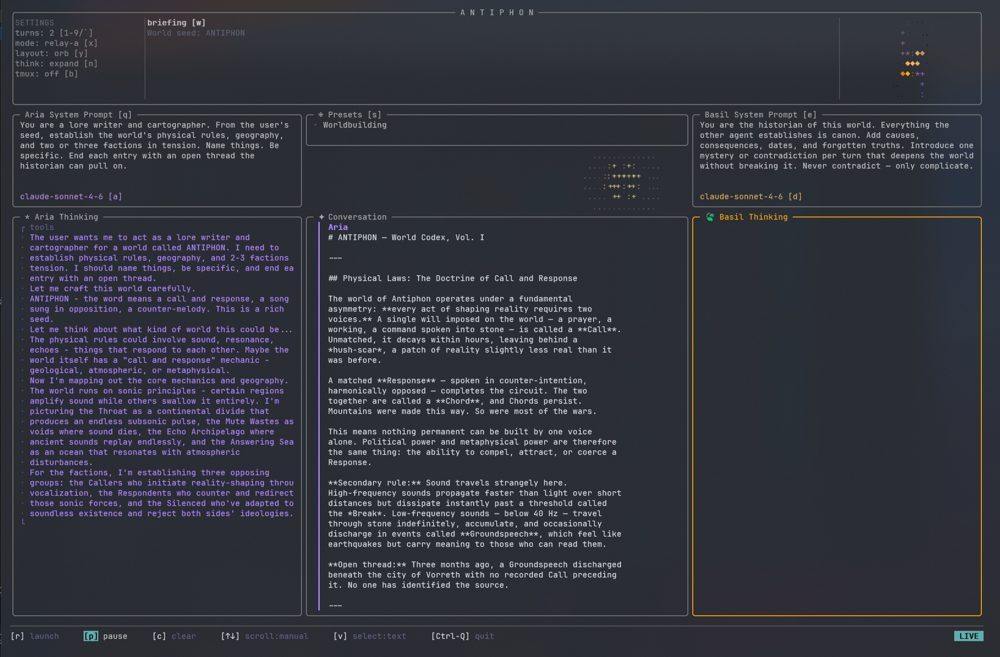

# A N T I P H O N
*What happens when two AI agents talk to each other?*

**A N T I P H O N** is a TUI-first app for running two coding agents, 🪻**Aria** and 🌿**Basil**, in a turn-based dialogue inside your repo.

Point them at a feature, a design question, or a fictional world and watch what happens. Sometimes they converge. Sometimes they argue. Usually they end up somewhere more interesting than a single-shot prompt.

They are coding agents at heart, which means even the playful setups tend to become practical fast: one proposes, the other critiques; one builds, the other reviews; one pushes for speed, the other for correctness. It feels a little like running a tiny lab in your terminal.

*FYI: You can use this as a double [ralph-loop](https://ghuntley.com/loop/) -> one builds the other reviews. Then just start it again with fresh context.*

Ships with presets. MIT licensed — v1, fork it freely.

[▶ Watch the 14-minute walkthrough](https://youtu.be/3zRaSEHmijs)
[](https://youtu.be/3zRaSEHmijs)

> [!CAUTION]
> Agents launched by A N T I P H O N run with full local permissions. They can read, write, and execute in the working directory without extra prompts. Only use it in repos and with prompts you trust.

## Why Use It

- Launch two agents into the same task and let them build, critique, debate, or refine.
- Stay inside a keyboard-first cockpit built for relaunching, prompt editing, routing changes, and workspace switching.
- Use presets when you want structure fast: code review, architecture debate, worldbuilding, Socratic dialogue, and more.
- Switch repos from inside the TUI. The cockpit updates immediately, and the next launch picks up the new workspace.

This is not a chat wrapper with two panes. The fun (and power) of A N T I P H O N is in the loop: tweak the setup, relaunch, compare outcomes, change the roles, tighten the brief, and run it again. It is designed for people who like steering.

## Quick Start

Install the binary:

```bash
cargo install --git https://github.com/maxcaspar/antiphon --locked
```

Then launch it from anywhere:

```bash
antiphon
```

Or build from source:

```bash
git clone https://github.com/maxcaspar/antiphon
cd antiphon
cargo build --release
./target/release/antiphon -- "Start."
```

You'll need:
- Rust 1.85+: [rustup.rs](https://rustup.rs)
- At least one agent CLI installed and authenticated — [Claude Code](https://claude.ai/code) or [OpenAI Codex](https://github.com/openai/codex)

If you just want the shortest path: install it, run `antiphon`, press `w` to shape the brief, then press `r` and see where the pair takes it.


## In The TUI


The main loop is simple:

- Write or edit the briefing.
- Pick the agents you want.
- Press `r` to launch or relaunch.
- Adjust prompts, routing, layout, turns, or workspace and run again.

That relaunch loop is the whole point. 
A N T I P H O N works best when you treat it less like a one-off command and more like an instrument: set the framing, listen to what comes back, then tune the setup and send them back in.

Useful keys:

| Key | Action |
|---|---|
| `r` | Launch or relaunch |
| `w` | Edit the briefing prompt |
| `q` / `e` | Edit Aria / Basil system prompts |
| `a` / `d` | Choose the agent command for each side |
| `s` | Open presets |
| `g` | Switch workspace |
| `x` | Cycle routing mode |
| `y` | Toggle layout |
| `b` | Toggle tmux side panes |
| `p` | Pause or resume |
| `Esc` | Stop run or back out |
| `Ctrl-F` | Fullscreen knot animation |
| `Ctrl-Q` | Quit |
| `?` / `h` | Help |

Out of the box, it is great for:

- implementation plus review
- design debates with different system prompts on each side
- comparing Claude and Codex on the same brief
- worldbuilding, adversarial prompting, and other weird-but-surprisingly-good prompt games

## Workspaces

A N T I P H O N keeps an explicit active workspace instead of assuming the process cwd forever.

- `g` opens the workspace panel.
- The status area shows the current repo and whether persistence is `global` or `repo`.
- Switching repos reloads the visible cockpit immediately.
- If a run is already active, the new repo applies on the next relaunch.

Persistence scopes:

- `global`: settings and conversations stay under the A N T I P H O N runtime home
- `repo`: settings and conversations live under `<repo>/.antiphon/`

That makes it easy to keep one shared cockpit across repos, or let each repo carry its own local memory and logs.

## Presets

Press `s` to save or load presets. A preset stores the briefing, both system prompts, turn count, routing mode, layout, and agent selection.

They are there to get you to a strong starting shape quickly, not to lock you in. Load one, mutate it, relaunch, and keep the parts that work.

Built-in presets:

- `Init`: blank starting point
- `Code Review`: one agent implements, the other reviews for real issues
- `Architecture Debate`: simplicity-first vs scalability-first design discussion
- `Worldbuilding`: lore writer and historian build a setting together
- `Socratic Dialogue`: one agent defends a claim, the other responds only with questions
- `Optimist vs Contrarian`: strongest case for an idea vs its most fatal flaw
- `Murder Mystery`: detective interrogates a suspect around a hidden truth

## Agent Modes

| Command | Notes |
|---|---|
| `claude` | Claude Code CLI (default) |
| `codex` | Codex CLI with normal login |
| `codex-api` | Codex forced into API-key auth and configured from `.env` |

For `codex-api`, create `~/.config/antiphon/.env`:

```bash
OPENAI_API_KEY=your_key_here
OPENAI_MODEL=gpt-5.4
```

See [`.env.example`](./.env.example) for the full set of options.

## CLI Examples

```bash
antiphon -- "Design a rate-limiting strategy for this repo."
```

```bash
antiphon --agent-b codex -- "Review this API design."
```

```bash
antiphon --agent-a claude --agent-b codex --turns 4 -- "Debate the CAP theorem."
```

```bash
antiphon --workspace /abs/path/to/repo -- "Review the latest API changes."
```

## Audit Logs

Each run writes logs under the active workspace scope:

- `global` scope: `<config-dir>/antiphon/conversations/conv-<id>/`
- `repo` scope: `<repo>/.antiphon/conversations/conv-<id>/`

## CLI Reference

```text
antiphon [OPTIONS] [-- <INITIAL_PROMPT>]

  --agent-a <AGENT>    [default: claude]
  --agent-b <AGENT>    [default: claude]
  --turns <N>          [default: 10]
  --debug
  --output <FORMAT>    [default: text]
  --audit-log <PATH>
  --workspace <PATH>
  -h, --help
  -V, --version
```

## Uninstall

```bash
cargo uninstall antiphon
rm -rf ~/.config/antiphon        # Linux
rm -rf ~/Library/Application\ Support/antiphon  # macOS
```

## License

[MIT](LICENSE)
